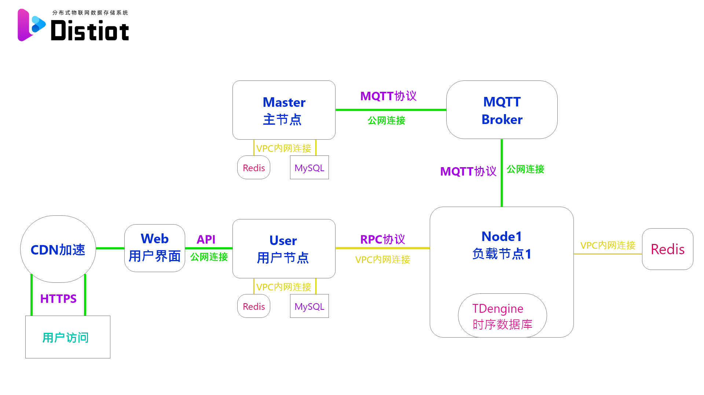
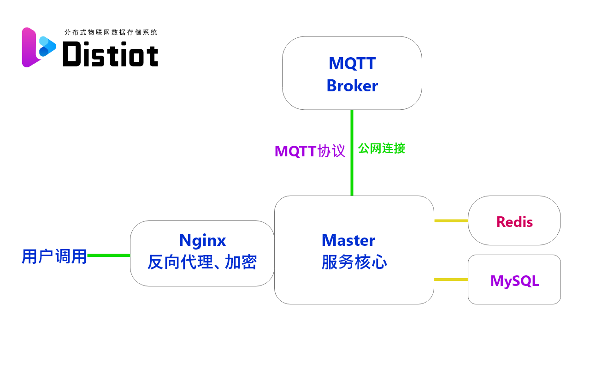
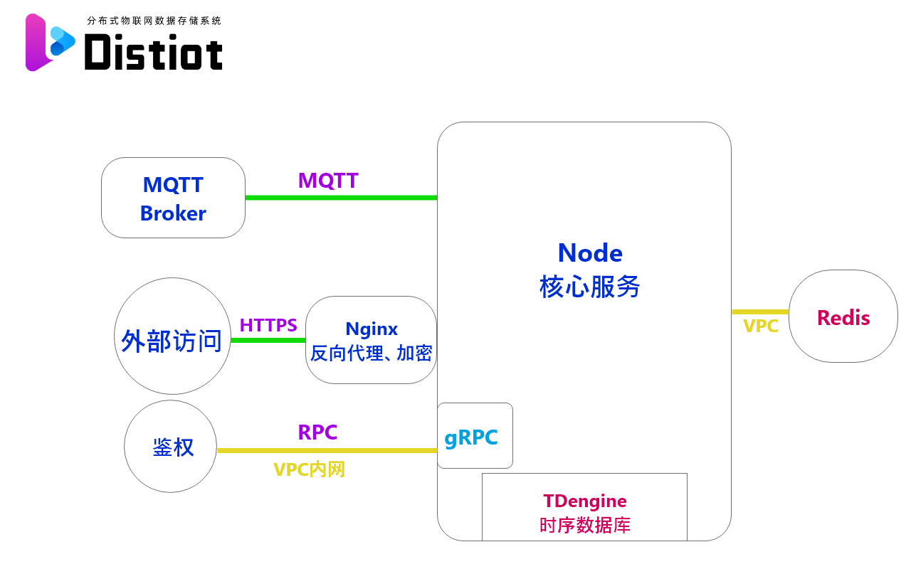
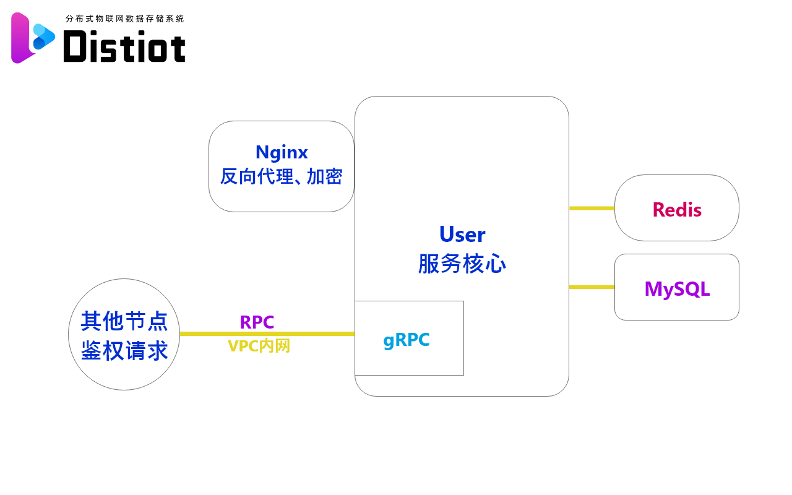

# distiot-master

我的本科毕业设计 Distiot

一个分布式物联网数据存储系统，本代码库为master节点

# 项目简介

本平台不是一个传统的“物联网项目”,而是类似 Hadoop 的基础设施,为海量的物联网设备提供数据存储、数据分析可视化、以及对硬件的远程控制。对于初级开发者而言,只需完成硬件端的数据采集上传,即可搭建简单的物联网项目;对高级开发者,本平台提供了相关的 SDK 和 API,开发者可以通过 SDK 和 API 实现更加强大的功能,比如通过 API 获取一定格式的数据,自己搭建后端进行数据的分析处理,而无需在意海量数据的存储。

**设计目标**：分布式、高性能、弹性可拓展、全面上云

## 分布式

本项目采用分布式架构,多个节点部署在多台服务器上,单个节点独享一台 ECS。

* 节点均处于一个云内网,内部延迟低带宽高,节点间采用 gRPC 进行高效通信。
* 所有节点均配备云 Redis,缓存热点数据,减轻硬盘 IO 和数据库压力;
* 工作节点内部使用 TDengine 时序数据库存储数据,搭配 ESSD 硬盘,最大化读写性能;
* 所有后端服务均使用 Golang 编写

分布式架构图如下：

本项目全面上云，最终部署在阿里云，云服务架构如下：

# 各节点架构

本项目使用分布式架构，设置**Master Node User**三种节点。

除三种节点外，Distiot使用了Vue搭建了[Web UI页面](https://github.com/Sirlanri/distiot-user-web)，提供登录、注册、管理设备、可视化等服务；使用了WordPress搭建了文档站，提供开发文档和[基于树莓派开发的Demo](https://github.com/Sirlanri/distiot-pi-upload)；提供了[Golang](https://github.com/Sirlanri/distiot-sdk-go)和[C语言](https://github.com/Sirlanri/distiot-sdk-c)的SDK供开发者使用。

## Master节点

[Master 节点](https://github.com/Sirlanri/distiot-master)不参与数据的处理,只负责分配和管理 Node 工作节点，支持 HTTP 和 MQTT 两种通讯协议。其中 MQTT 主要用于监听 Node 节点的心跳信息,将心跳信息存入 Redis 数据库;也用于 Node 节点的自动上线注册。架构图如下：

## Node节点

[Node 工作节点](https://github.com/Sirlanri/distiot-node)为真实的负载节点,直接处理数据上传存储和读取等工作。硬件上,每个 Node 节点都部署在独立的 ECS 上,搭配一台Redis数据库。针对物联网数据的特点，使用了高性能的[TDengine时序数据库](https://github.com/taosdata/TDengine)。架构图如下：

## User节点

[User 用户节点](https://github.com/Sirlanri/distiot-user-server)的功能分为两部分:为 User-Web 页面服务的后端、为 Node 集群和 Master 提供权限控制。使用了MySQL+Redis两种数据库，缓存热点数据，减少MySQL压力。架构图如下：

